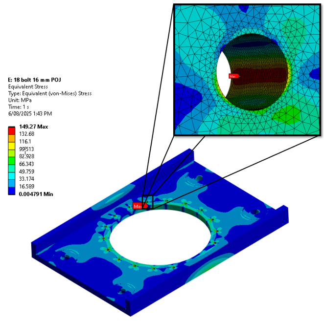

# Projects

### Suspension CAD Modelling - QEV6

 

 
The task was to develop a CAD model of the QUT Motorsport 2026 suspension system using the updated suspension geometry. The new geometry was designed to reduce the vehicle's track width while still meeting the required suspension movement and packaging requirements. This change aims to reduce the vehicle's turning radius, improving its maneuverability and overall performance on the tight, low-speed tracks used in Formula Student competitions.

### Tensile Testing Jig

 

 
The objective of this project was to design and validate a structural pull-out test fixture for the mechanical characterisation of composite panels used in the Formula Student Structural Equivalency Spreadsheet (SES). The fixture was required to exhibit negligible structural compliance under an applied pull-out load of 15 kN, ensuring that the measured force–displacement response is governed by deformation of the composite specimen rather than elastic deflection of the test apparatus. This design requirement is critical for obtaining representative experimental data to support SES compliance, material characterisation, and correlation between physical testing and analytical predictions.

### Undertray
